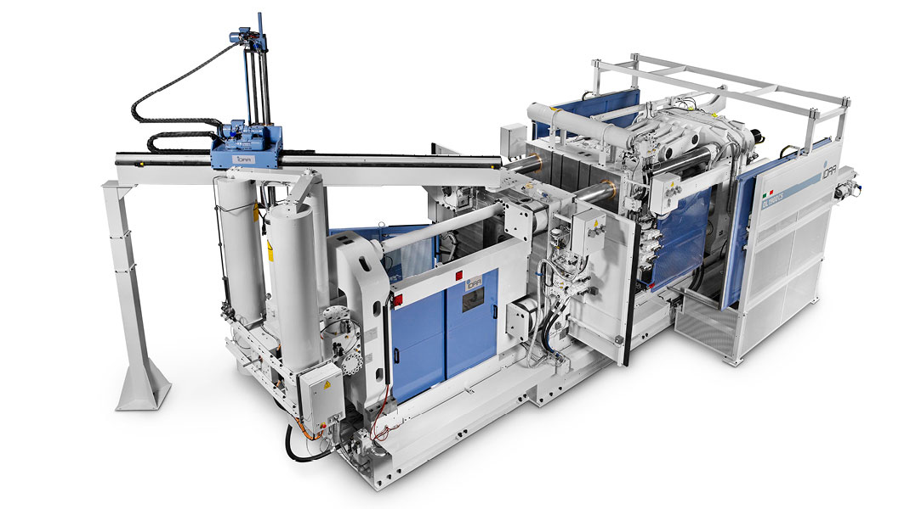
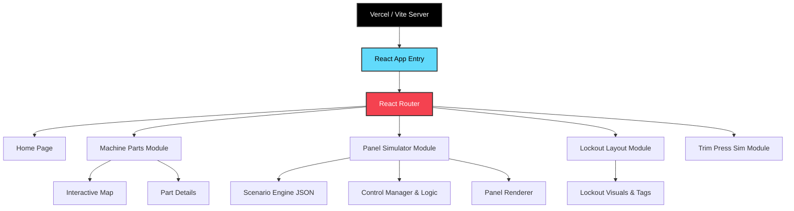

# DCMO - Die Casting Machine Training Portal


## Software Architecture



DCMO is a comprehensive, web-based interactive training portal designed to train operators on industrial Die Casting Machines. It provides a risk-free digital environment to learn machine components, practice safety lockouts, and operate control panels.

## Live Demo

🚀 **Experience the portal live:** [https://dcmo.vercel.app/](https://dcmo.vercel.app/)

Deployed and hosted seamlessly on [Vercel](https://vercel.com).

## Training Modules

The portal is divided into several specialized interactive modules:

1. **DCM Parts**
   - Explore the core components and systems of Die Casting Machines.
   - Interactive visual map to learn part locations and functions.
2. **Panel Simulator**
   - Interactive 3D-like digital replica of the machine's control panel.
   - Realistic simulation of momentary push buttons, guarded toggles, pilot lights, 3-position switches, and infinite-scroll 12-position rotary dials.
   - Dynamic scenario engine with visual feedback (Purple for interaction, Yellow for visual checks).
3. **Lockout Layout**
   - Digital floor plan indicating critical safety lockout points.
   - Learn where to isolate energy for various maintenance scenarios.
   - View real-world reference photos for lockout procedures.
4. **Trim Press Sim**
   - Full 3D digital twin of a trim press with live simulation and operational controls.

## Features

- **Dynamic Scenario Engine**: JSON-driven architecture allows for easy creation of training modules and step-by-step instructions.
- **Advanced State Management**: Pre-configurable initial states for every training module, allowing scenarios to start from complex machine states.
- **Responsive Design**: Designed to work flawlessly across desktop browsers and mobile devices.
- **Mobile Connect**: Quick-access QR Code system to easily launch simulators on mobile devices.

## Technology Stack

- [React](https://react.dev/) & [React Router](https://reactrouter.com/)
- [Tailwind CSS](https://tailwindcss.com/) & Custom CSS styling
- Vanilla JavaScript (Core Simulation Engines)
- [Vite](https://vitejs.dev/) - Fast frontend build tool

## Getting Started

### Prerequisites
Make sure you have [Node.js](https://nodejs.org/) installed on your machine.

### Installation

1. Clone this repository:
   ```bash
   git clone git@github.com:eduardomatos66/dcmo.git
   ```
2. Navigate into the project directory:
   ```bash
   cd dcmo
   ```
3. Install dependencies:
   ```bash
   npm install
   ```

### Running Locally

To start the development server, run:
```bash
npm run dev
```
The simulator will be available in your browser (usually at `http://localhost:5173`).

## Creating New Panel Scenarios

Panel scenarios dictate the step-by-step training process and are fully data-driven. To create a new scenario:
1. Create a `.json` file inside `src/scenarios/` (or update existing ones).
2. Define the `id`, `title`, and optionally an `initialState`.
3. Add sequential `steps` containing instructions, interaction targets, checks, and success logic (like delays, blinking lights, or solid lights).
4. Import and add your scenario to the `scenariosData` array in the respective index file.

---

**Developed by Eduardo Matos**
