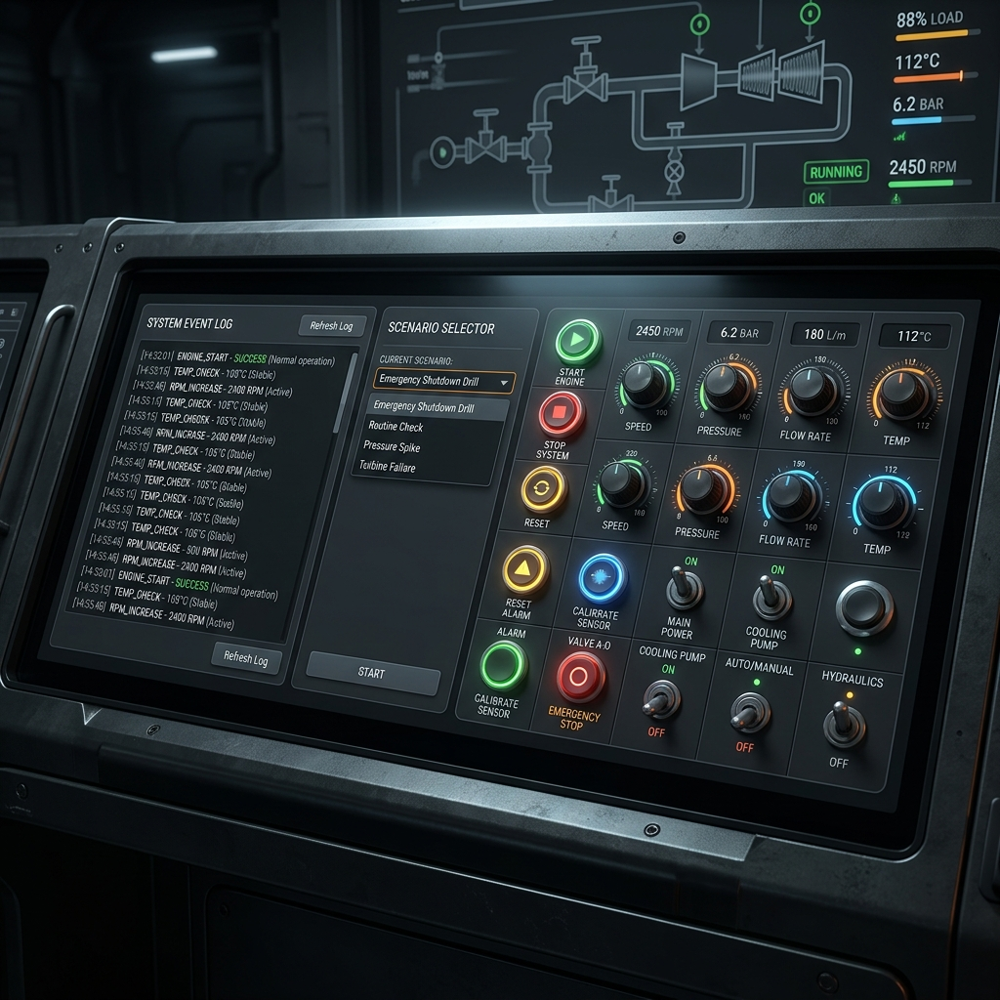
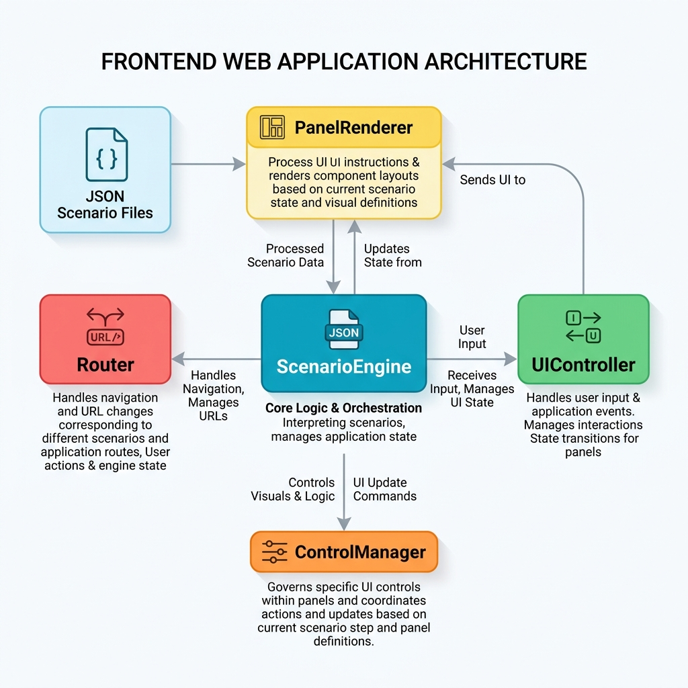

# DCMO - Die Casting Machine Simulator




DCMO is a web-based, interactive training simulator designed to train operators on the control panels of industrial Die Casting Machines. It replicates physical switches, buttons, and system behaviors in a risk-free digital environment.

## Features

- **High-Fidelity Physical Interactions**: Realistic simulation of momentary push buttons, guarded toggles, pilot lights, 3-position switches, and infinite-scroll 12-position rotary dials.
- **Dynamic Scenario Engine**: JSON-driven architecture allows for easy creation of training modules without touching the core code.
- **Visual Feedback System**: 
  - 🟪 **Purple Highlights**: Indicate the interactive target for the current step.
  - 🟨 **Yellow Highlights**: Indicate visual checks (e.g., verifying a light state before proceeding).
- **Advanced State Management**: Pre-configurable initial states for every training module, allowing scenarios to start from complex machine states (e.g., cycle stopped, ladle in home position).
- **Free Mode (Sandbox)**: A dedicated mode where the training engine is disabled, unlocking the entire panel for free operation and testing.

## Technology Stack

- HTML5
- CSS3 (Custom Flexbox Grid & Advanced UI Styling)
- Vanilla JavaScript (ES6 Modules)
- [Vite](https://vitejs.dev/) - Fast frontend build tool

## Getting Started

### Prerequisites
Make sure you have [Node.js](https://nodejs.org/) installed on your machine.

### Installation

1. Clone this repository:
   ```bash
   git clone git@github.com:eduardomatos66/dcmo.git
   ```
2. Navigate into the project directory:
   ```bash
   cd dcmo
   ```
3. Install dependencies:
   ```bash
   npm install
   ```

### Running Locally

To start the development server, run:
```bash
npm run dev
```
The simulator will be available in your browser (usually at `http://localhost:5173`).

## Creating New Scenarios

Scenarios dictate the step-by-step training process and are fully data-driven. To create a new scenario:
1. Create a `.json` file inside `src/scenarios/`.
2. Define the `id`, `title`, and optionally an `initialState`.
3. Add sequential `steps` containing instructions, interaction targets, checks, and success logic (like delays, blinking lights, or solid lights).
4. Import and add your scenario to the `scenariosData` array in `src/scenarios/index.js`.

---

**Built by the Eduardo Matos Team.**
